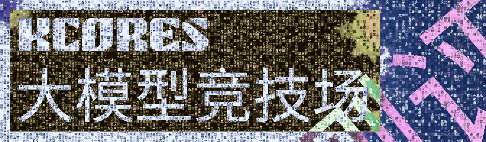
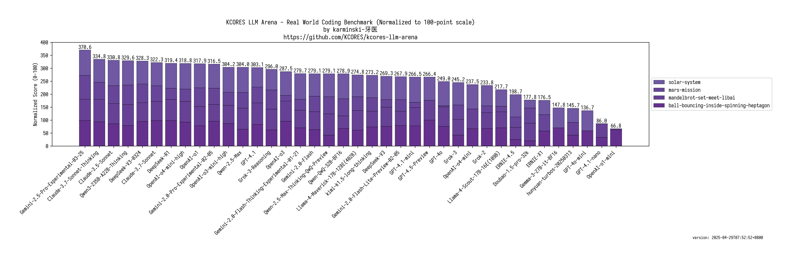
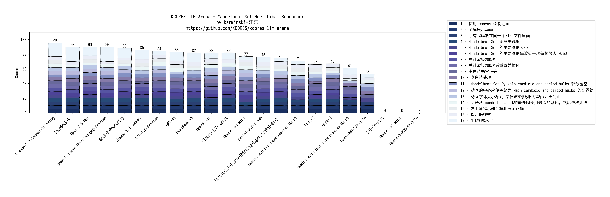

KCORES LLM Arena - KCORES 大模型竞技场
-------------------------------------

## Desc

现有的大模型评测大多数都是做选择题, 导致十分容易针对测试进行优化, 进而结果失真.

所以本测试专注于现实世界场景, 并采用人工评分和基准测试的方式进行评测, 力争还原大模型在现实世界中的表现.

## 编程能力测试

- version: **2025-03-02**
- Winner: **👑Claude-3.7-Sonnet-Thinking**

### 结论

目前最好的编程大模型是什么？直接说结论，**👑Claude-3.7-Sonnet-Thinking** 当之无愧, 甚至 Claude 系列都是非常好的选择。

那么除了Claude全家桶，最好的选择是什么？答案是 **DeepSeek-R1**

OpenAI 系列呢？答案是 **OpenAI-o1**

Gemini 系列则是 **Gemini-2.0-Pro**

Grok 嘛...开心那就好

### 测试子项

**[Mandelbrot Set Meet LiBai Benchmark](./benchmark-mandelbrot-set-meet-libai/README.md)**

#### 该项目主要测试

- 性能优化
  - 双缓冲或三缓冲
  - 离屏渲染
  - WebWorker 多线程
- 需求还原
  - 给定了20种颜色进行渲染
  - 动画效果
  - CSS样式
- 字符串处理
  - 过滤
  - 去重
  - 保证字符串顺序
- 计算
  - FPS与平均FPS计算
- 数学
  - Mandelbrot Set
  - 理解 Mandelbrot Set 各个气泡
  - 使画面中心保持在气泡交界处
- 编程语言
  - JavaScript
  - HTML, CSS
- Prompt 语言
  - 英语

**[Mars Mission Benchmark](./benchmark-mars-mission/README.md)**

#### 该项目主要测试

- 需求还原
  - 展示各个行星
  - 动画效果展示公转
  - 展示轨迹
- 需求补全
  - 补全演示中缺失的坐标系与图例
  - 渲染太阳
- 计算
  - 圆周轨道与运行周期
  - 飞船的飞行轨迹
  - 飞船准确降落行星
- 物理
  - 天体运行轨道半径
  - 天体运行周期
  - 飞行器发射窗口与返回窗口
- 编程语言
  -Python
- Prompt 语言
  - 中文

**[Solar System Benchmark](./benchmark-solar-system/README.md)**

#### 该项目主要测试

- 需求还原
  - 展示各个行星
  - 动画效果展示公转
  - 展示轨迹
  - CSS样式
  - 动画效果
  - 行星名称标签
- 计算
  - 圆周轨道与运行周期
  - FPS与平均FPS计算
- 物理
  - 天体运行轨道半径
  - 天体运行周期
  - 天体大小
- 创意
  - 行星的颜色渲染
- 编程语言
  - JavaScript
  - HTML, CSS
- Prompt 语言
  - 中文

**[Ball Bouncing Inside Spinning Heptagon](./benchmark-ball-bouncing-inside-spinning-heptagon/README.md)**

#### 该项目主要测试

- 需求还原
  - 展示7边形旋转
  - 展示20个小球的物理运动
  - 展示小球上面的数字
  - 小球大小一致
- 计算
  - 相关物理效果计算
  - 7边形的旋转
  - 小球不会重叠
  - 小球不会超过7边形
- 物理
  - 摩擦，碰撞，重力，小球弹性模拟
- 编程语言
  -Python
- Prompt 语言
  - 英语

  

## License

[KCORES License Version 1.0](./LICENSE_zh-CN)
