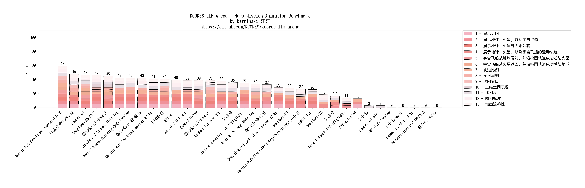
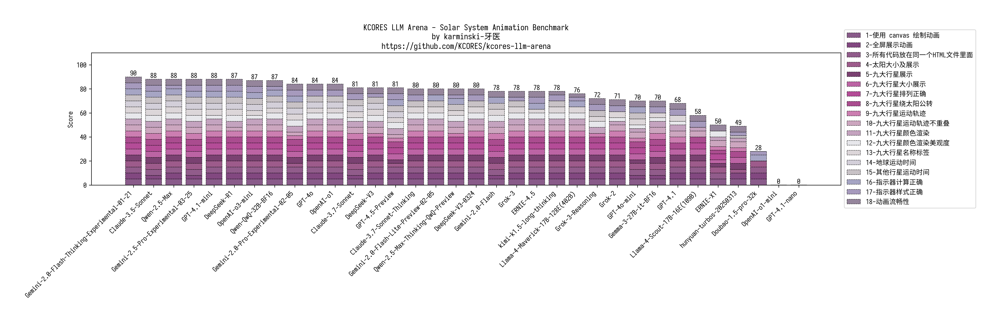

KCORES LLM Arena - KCORES 大模型竞技场
-------------------------------------

## Desc

现有的大模型评测大多数都是做选择题, 导致十分容易针对测试进行优化, 进而结果失真.

所以本测试专注于现实世界场景, 并采用人工评分和基准测试的方式进行评测, 力争还原大模型在现实世界中的表现.

## 编程能力测试

- version: **2025-03-02**
- Winner: **👑Claude-3.7-Sonnet-Thinking**

### 结论

目前最好的编程大模型是什么？直接说结论，**👑Claude-3.7-Sonnet-Thinking** 当之无愧, 甚至 Claude 系列都是非常好的选择。

那么除了Claude全家桶，最好的选择是什么？答案是 **DeepSeek-R1**

OpenAI 系列呢？答案是 **OpenAI-o1**

Gemini 系列则是 **Gemini-2.0-Pro**

Grok 嘛...开心那就好

### 测试子项

- [Mandelbrot Set Meet LiBai Benchmark](./benchmark-mandelbrot-set-meet-libai/README.md)

- [Mars Mission Benchmark](./benchmark-mars-mission/README.md)

- [Solar System Benchmark](./benchmark-solar-system/README.md)

- [Ball Bouncing Inside Spinning Hexagon](./benchmark-ball-bouncing-inside-spinning-hexagon/README.md)

  

## License

[KCORES License Version 1.0](./LICENSE_zh-CN)
