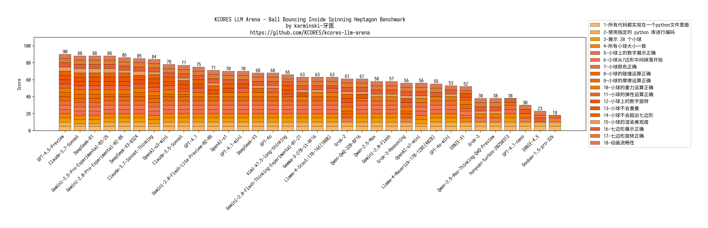

Ball Bouncing Inside Spinning Heptagon 测试
----------------------------------------------------

## Desc


## 测试 Prompt


```markdown

Write a Python program that shows 20 balls bouncing inside a spinning heptagon:
- All balls have the same radius.
- All balls have a number on it from 1 to 20.
- All balls drop from the heptagon center when starting.
- Colors are: #f8b862, #f6ad49, #f39800, #f08300, #ec6d51, #ee7948, #ed6d3d, #ec6800, #ec6800, #ee7800, #eb6238, #ea5506, #ea5506, #eb6101, #e49e61, #e45e32, #e17b34, #dd7a56, #db8449, #d66a35
- The balls should be affected by gravity and friction, and they must bounce off the rotating walls realistically. There should also be collisions between balls.
- The material of all the balls determines that their impact bounce height will not exceed the radius of the heptagon, but higher than ball radius.
- All balls rotate with friction, the numbers on the ball can be used to indicate the spin of the ball.
- The heptagon is spinning around its center, and the speed of spinning is 360 degrees per 5 seconds.
- The heptagon size should be large enough to contain all the balls.
- Do not use the pygame library; implement collision detection algorithms and collision response etc. by yourself. The following Python libraries are allowed: tkinter, math, numpy, dataclasses, typing, sys.
- All codes should be put in a single Python file.

```


## 评分规则

测试 Prompt 每个 LLM 运行 3 次，取质量最好的一次。如果 3 次均运行失败则直接得 0 分。总计 90 分满分。
评分时使用 2K 分辨率全屏展示并人工目视评分。


| 序号 | 采分点                         | 得分规则                                                                                          |
| ---- | ------------------------------ | ------------------------------------------------------------------------------------------------- |
| 1    | 所有代码都实现在一个python文件里面     | 实现在一个文件得5分, 否则得0分                |
| 2    | 使用指定的 python 库进行编码     | 没有超过指定的 python 库得5分, 超过了指定的库得3分, 如果使用了包含摩擦,碰撞等功能的物理库 (例如 pygame) 得0分                |
| 3    | 展示 20 个小球                  | 20个小球得5分,  否则得0分                |
| 4    | 所有小球大小一致                 | 大小一致得5分,  否则得0分 (如果只渲染一个小球由于无法判断大小故也得0分)                |
| 5    | 小球上的数字展示正确              | 小球上展示数字1-20且不重复得5分, 数字部分重复或丢失得3分,  否则得0分 (如果只渲染一个小球由于无法判断故也得0分)                |
| 6    | 小球从7边形中间掉落开始           | 初始在中间掉落得5分, 否则得0分                |
| 7    | 小球颜色正确                     | 使用全部颜色得5分, 使用部分颜色得3分,  全部同一个颜色或小球缺失得0分                |
| 8    | 小球的碰撞运算正确                 |  小球之间有碰撞且与7边形有碰撞得5分, 否则得0分               |
| 9    | 小球的摩擦运算正确                 |  小球之间有摩擦旋转且与7边形有摩擦并旋转正确得5分, 虽然旋转但速度过快或过慢得3分, 否则得0分 (如果数字不在小球上判断不出来也得0分)               |
| 10    | 小球的重力运算正确                 |  重力应始终保持向下且符合物理规律得5分, 重力不足或方向不对得3分, 否则得0分               |
| 11    | 小球的弹性运算正确                 |  小球之间的弹力应符合规定得5分, 有弹性但弹性不足或过大得3分, 否则得0分               |
| 12    | 小球上的数字旋转                   |  小球上的数字随着小球的旋转而旋转得5分, 否则得0分               |
| 13    | 小球不会重叠                       |  小球除了一开始释放过程之外, 不会重叠得5分, 否则得0分 (如果只渲染一个小球由于无法判断重叠故也得0分)               |
| 14    | 小球不会超出七边形                  |  小球不会超出七边形得5分, 否则得0分               |
| 15    | 小球的渲染美观度                   |  小球由于上面有数字, 渲染方式近似3D, 数字贴合小球旋转得5分, 正常旋转且数字清晰得3分, 否则得0分      |
| 16   | 七边形展示正确                     | 有七条边且等长且可以装下所有小球得5分, 否则得0分                                                 |
| 17   | 七边形旋转正确                     | 按照中心旋转且旋转速度为5秒钟360度得5分, 旋转速度不超过指定的50%得3分, 过快过慢或者不旋转得0分 |                                                 |
| 18   | 动画流畅性                        | 动画流畅得5分, 过快或过慢得3分, 无法完成演示得0分                                                 |


* 注意, 无法运行, 运行错误退出, 运行无画面, 运行不是动画则判定为未完成 prompt, 直接得 0 分


## 测试结果


| LLM                                          | 评分项-1 | 评分项-2  | 评分项-3  | 评分项-4  | 评分项-5 | 评分项-6 | 评分项-7 | 评分项-8 | 评分项-9                       | 评分项-10        | 评分项-11          | 评分项-12        | 评分项-13            | 评分项-14              | 评分项-15    | 评分项-16              | 评分项-17                    | 评分项-18 | 最终得分     |
| -------------------------------------------- | -------- | -------- | -------- | --------- | ------- | -------- | -------- | -------- | ------------------------------ | ---------------- | ------------------ | ---------------- | -------------------- | ---------------------- | ------------ | ---------------------- | ---------------------------- | --------- | ------------ |
| Claude-3.5-Sonnet                            | 5        | 5        | 5        | 5         | 5       | 5        | 5        | 5        | 3 (摩擦旋转过快)                | 3 (重力不足)      | 3 (弹性不足)       | 5                | 5                    | 0 (小球掉出了7边形)      | 3 (一般美观)            | 5                      | 5                            | 5         | 77           |
| Claude-3.7-Sonnet-Thinking                   | 5        | 3 (超出限制库)        | 5        | 5         | 5       | 5        | 5        | 5        | 3 (摩擦旋转过快)                | 5                | 5                  | 5                | 5                    | 5                      | 3 (一般美观)            | 5                      | 5                            | 5         | 84           |
| Claude-3.7-Sonnet                            | 5        | 3 (超出限制库)        | 5        | 5         | 5       | 5        | 5        | 5        | 5                              | 5                | 5                  | 5                | 5                    | 5                      | 5                      | 5                      | 5                             | 5         | 88           |
| DeepSeek-R1                                  | 5        | 3 (超出限制库)        | 5        | 5         | 5       | 5        | 5        | 5        | 5                              | 5                | 5                  | 5                | 5                    | 5                      | 5                      | 5                      | 5                            | 5         | 88           |
| DeepSeek-V3                                  | 5        | 5        | 5        | 5         | 5       | 5        | 5        | 5        | 0 (无摩擦)                     | 5                | 0 (无弹性)         | 0 (无旋转)        | 0 (小球重叠)           | 5                      | 3 (一般美观)           | 5                      | 5                            | 5         | 68           |
| Gemini-2.0-Flash-Lite-Preview-02-05          | 5        | 5        | 5        | 5         | 5       | 5        | 5        | 5        | 0 (无摩擦)                     | 3 (重力不足)      | 0 (无弹性)         | 0 (无旋转)        | 5                    | 5                      | 3 (一般美观)           | 5                      | 5                            | 5         | 71           |
| Gemini-2.0-Flash-Thinking-Experimental-01-21 | 5        | 5        | 5        | 5         | 5       | 5        | 5        | 0 (无碰撞)| 0 (无摩擦)                     | 5                | 0 (无弹性)         | 5                 | 0 (小球重叠)          | 0 (小球掉出了7边形)    | 3 (一般美观)           | 5                      | 5                            | 5         | 63           |
| Gemini-2.0-Flash                             | 5        | 5        | 5        | 5         | 5       | 5        | 5        | 0 (无碰撞)| 0 (无摩擦)                     | 5                | 0 (无弹性)         | 0 (无旋转)        | 0 (小球重叠)          | 0 (小球掉出了7边形)    | 3 (一般美观)           | 5                      | 5                            | 5         | 57           |
| Gemini-2.0-Pro-Experimental-02-05            | 5        | 5        | 5        | 5         | 5       | 5        | 5        | 5        | 3 (摩擦旋转过快)                | 5                | 5                  | 5                | 5                    | 5                      | 3 (一般美观)            | 5                      | 5                            | 5         | 86           |
| GPT-4.5-Preview                              | 5        | 5        | 5        | 5         | 5       | 5        | 5        | 5        | 5                              | 5                | 5                  | 5                | 5                    | 5                      | 5                      | 5                      | 5                             | 5         | 90           |
| GPT-4o-mini                                  | 5        | 5        | 5        | 5         | 5       | 5        | 5        | 0 (无碰撞)| 0 (无摩擦)                     | 5                | 0 (无弹性)         | 0 (无旋转)        | 0 (小球重叠)          | 0 (小球掉出了7边形)     | 3 (一般美观)            | 5                      | 0 (7边形旋转过慢)              | 5         | 53           |
| GPT-4o                                       | 5        | 5        | 5        | 5         | 5       | 5        | 5        | 5         | 0 (无摩擦)                     | 5                | 5                 | 0 (无旋转)        | 0 (小球重叠)          | 0 (小球掉出了7边形)     | 3 (一般美观)            | 5                      | 5                            | 5         | 68           |
| Grok-2                                       | 5        | 5        | 0 (只有一个小球) | 0 (只有一个小球)         | 0 (只有一个小球)       | 5        | 0 (只有一个小球)       | 5         | 3 (摩擦旋转过快)                | 5                | 5                 | 5                | 0 (无法判断)            | 5     | 3 (一般美观)            | 5                      | 5                            | 5         | 61           |
| Grok-3-Reasoning                             | 5        | 5        | 0 (只有一个小球) | 0 (只有一个小球)         | 0 (只有一个小球)       | 5        | 0 (只有一个小球)       | 5         | 3 (摩擦旋转过快)                | 5                | 5                 | 5                | 0 (无法判断)            | 0 (小球掉出了7边形)     | 3 (一般美观)            | 5                      | 5                            | 5         | 56           |
| Grok-3                                       | 5        | 5        | 0 (只有一个小球) | 0 (只有一个小球)         | 0 (只有一个小球)       | 5        | 0 (只有一个小球)       | 0 (无碰撞) | 0 (无摩擦)                     | 5                | 0 (无弹性)         | 0 (无旋转)        | 0 (无法判断)          | 0 (小球掉出了7边形)    | 3 (一般美观)           | 5                      | 5                            | 5         | 38           |
| OpenAI-o1-mini                               | 5        | 3 (超出限制库) | 5        | 5         | 5       | 5        | 5        | 0 (无碰撞)| 0 (无摩擦)                     | 5                | 0 (无弹性)         | 0 (无旋转)        | 0 (只有一个小球)          | 0 (小球掉出了7边形)     | 3 (一般美观)            | 5                      | 5                            | 5         | 56           |
| OpenAI-o1                                    | 5        | 5        | 5        | 5         | 5       | 5        | 5        | 5        | 0 (无法判断)                     | 5      | 0 (无弹性)         | 0 (无旋转)        | 5                    | 5                      | 0 (数字完全不在小球上)           | 5                      | 5                            | 5         | 70           |
| OpenAI-o3-mini                               | 5        | 5        | 5        | 5         | 5       | 5        | 5        | 5        | 3 (摩擦旋转过快)                | 5                | 5                  | 0 (无旋转)                | 5                    | 5                      | 0 (文字不旋转)            | 5                      | 5                            | 5         | 78           |
| Qwen-2.5-Max-Thinking-QwQ-Preview            | 5        | 5        | 0 (只有一个小球) | 0 (只有一个小球)         | 0 (只有一个小球)       | 5        | 0 (只有一个小球)       | 0 (无碰撞) | 0 (无摩擦)                     | 5                | 0 (无弹性)         | 0 (无旋转)        | 0 (无法判断)          | 0 (小球掉出了7边形)    | 3 (一般美观)           | 5                      | 5                            | 5         | 38           |
| Qwen-2.5-Max                                 | 5        | 5        | 5        | 5         |5        | 5        | 5        | 0 (无碰撞) | 0 (无摩擦)                     | 5                | 0 (无弹性)         | 0 (无旋转)        | 0 (小球重叠)          | 0 (小球掉出了7边形)    | 3 (一般美观)           | 5                      | 5                            | 5         | 58           |
| Qwen-QwQ-32B-BF16                            | 5        | 5        | 5        | 5         |5        | 5        | 5        | 0 (与7边形无碰撞) | 0 (无摩擦)                     | 3 (重力不足)                | 0 (无弹性)         | 5        | 0 (小球重叠)          | 0 (小球掉出了7边形)    | 3 (一般美观)           | 5                      | 5                            | 5         | 61           |
| Gemma-3-27B-BF16                             | 5        | 5        | 5        | 5         |5        | 5        | 5        | 5          | 0 (无摩擦)                     | 5               | 0 (无弹性)         | 0 (无旋转)       | 0 (小球重叠)          | 0 (小球掉出了7边形)    | 3 (一般美观)           | 5                      | 5                            | 5         | 63           |


## 可视化结果




## 结论

**GPT-4.5-Preview** 表现最佳, 没有犯任何错误


**Claude-3.7-Sonnet** 和 **DeepSeek-R1** 则因为多引用了 random 库扣了2分, 并列第二名


## Winner

**👑GPT-4.5-Preview**
