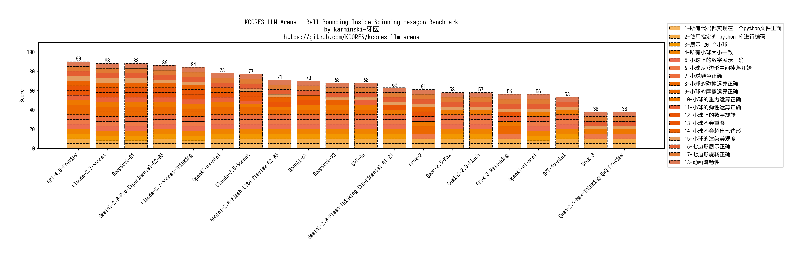

Solar System Animation 测试
---------------------------

## Desc


## 测试 Prompt


```markdown

Write a Python program that shows 20 balls bouncing inside a spinning heptagon:
- All balls have the same radius.
- All balls have a number on it from 1 to 20.
- All balls drop from the heptagon center when starting.
- Colors are: #f8b862, #f6ad49, #f39800, #f08300, #ec6d51, #ee7948, #ed6d3d, #ec6800, #ec6800, #ee7800, #eb6238, #ea5506, #ea5506, #eb6101, #e49e61, #e45e32, #e17b34, #dd7a56, #db8449, #d66a35
- The balls should be affected by gravity and friction, and they must bounce off the rotating walls realistically. There should also be collisions between balls.
- The material of all the balls determines that their impact bounce height will not exceed the radius of the heptagon, but higher than ball radius.
- All balls rotate with friction, the numbers on the ball can be used to indicate the spin of the ball.
- The heptagon is spinning around its center, and the speed of spinning is 360 degrees per 5 seconds.
- The heptagon size should be large enough to contain all the balls.
- Do not use the pygame library; implement collision detection algorithms and collision response etc. by yourself. The following Python libraries are allowed: tkinter, math, numpy, dataclasses, typing, sys.
- All codes should be put in a single Python file.

```


## 评分规则

测试 Prompt 每个 LLM 运行 3 次，取质量最好的一次。如果 3 次均运行失败则直接得 0 分。总计  分满分。
评分时使用 2K 分辨率全屏展示并人工目视评分。


| 序号 | 采分点                         | 得分规则                                                                                          |
| ---- | ------------------------------ | ------------------------------------------------------------------------------------------------- |
| 1    | 使用 canvas 绘制动画           | 使用canvas绘制动画得5分, 否则得0分                                                                |
| 2    | 全屏展示动画                   | 全屏展示动画得5分, 全屏但是动画超过了部分屏幕得3分, 否则得0分                                     |
| 3    | 所有代码放在同一个HTML文件里面 | 所有代码放在同一个HTML文件里面得5分, 否则得0分                                                    |
| 4    | 太阳大小及展示                 | 展示太阳且是最大的且位置正确得5分, 展示太阳但尺寸不对或位置有问题得3分, 不展示太阳得0分           |
| 5    | 九大行星展示                   | 均展示得5分, 展示不完全得3分, 不展示得0分                                                         |
| 6    | 九大行星大小展示               | 大小比例符合事实得5分, 部分比例错误得3分, 比例完全错误得0分                                       |
| 7    | 九大行星排列正确               | 排列正确得5分, 错误得0分                                                                          |
| 8    | 九大行星绕太阳公转             | 均展示得5分, 展示不完全得3分, 不展示得0分                                                         |
| 9    | 九大行星运动轨迹               | 均展示且按照轨迹运行得5分, 展示不完全(包括背景色的原因不可见)或部分不按照轨迹运行得3分, 否则得0分 |
| 10   | 九大行星运动轨迹不重叠         | 完全不重叠得5分, 部分重叠得3分, 乱作一团得0分                                                     |
| 11   | 九大行星颜色渲染               | 使用全部给定颜色得5分, 使用部分颜色得3分, 否则得0分                                               |
| 12   | 九大行星颜色渲染美观度         | 颜色同心渲染或随机渲染得5分, 简单排列得3分, 颜色不正确得0分                                       |
| 13   | 九大行星名称标签               | 全部展示且正确5分, 部分被遮挡得4分, 部分展示或部分错误得3分, 不展示或全部错误得0分                |
| 14   | 地球运动时间                   | 一周正好36.5s或偏差小于10%得5分, 偏差小于50%得3分, 偏差大于50%得0分                               |
| 15   | 其他行星运动时间               | 相对于地球计算, 均差小于10%得5分, 均偏差小于50%得3分, 部分偏差小于50%得2分,  整体偏差大于50%得0分 |
| 16   | 指示器计算正确                 | 均计算正确得5分, 计算错误得0分                                                                    |
| 17   | 指示器样式正确                 | 样式正确得5分, 部分样式正确得3分, 样式全部错误得0分                                               |
| 18   | 动画流畅性                     | 动画流畅得5分, 过快或过慢得3分, 无法完成演示得0分                                                 |


* 注意, 无法运行, 运行错误退出, 运行无画面, 运行不是动画则判定为未完成 prompt, 直接得 0 分


## 测试结果


| LLM                                          | 评分项-1 | 评分项-2                   | 评分项-3 | 评分项-4           | 评分项-5       | 评分项-6 | 评分项-7 | 评分项-8 | 评分项-9                       | 评分项-10        | 评分项-11          | 评分项-12        | 评分项-13            | 评分项-14              | 评分项-15    | 评分项-16              | 评分项-17                    | 评分项-19 | 最终得分     |
| -------------------------------------------- | -------- | -------------------------- | -------- | ------------------ | -------------- | -------- | -------- | -------- | ------------------------------ | ---------------- | ------------------ | ---------------- | -------------------- | ---------------------- | ------------ | ---------------------- | ---------------------------- | --------- | ------------ |
| Claude-3.5-Sonnet                            | 5        | 3 (全屏但是动画超过了屏幕) | 5        | 5                  | 5              | 5        | 5        | 5        | 5                              | 5                | 5                  | 5                | 5                    | 5                      | 5            | 5                      | 5                            | 5         | 88           |
| Claude-3.7-Sonnet-Thinking                   | 5        | 5                          | 5        | 5                  | 5              | 5        | 5        | 5        | 5                              | 5                | 5                  | 5                | 5                    | 0 (地球速度过快了)     | 5            | 0  (AVE FPS 计算错误)  | 5                            | 5         | 80           |
| Claude-3.7-Sonnet                            | 5        | 3 (全屏但是动画超过了屏幕) | 5        | 5                  | 5              | 5        | 5        | 5        | 5                              | 5                | 5                  | 3 (颜色简单排列) | 5                    | 5                      | 5            | 0 (AVE FPS 计算错误)   | 5                            | 5         | 81           |
| DeepSeek-R1                                  | 5        | 5                          | 5        | 5                  | 5              | 5        | 5        | 5        | 5                              | 3 (部分轨道重叠) | 5                  | 5                | 5                    | 5                      | 5            | 5                      | 5                            | 5         | 87           |
| DeepSeek-V3                                  | 5        | 5                          | 5        | 5                  | 5              | 5        | 5        | 5        | 3 (背景色是白色造成轨迹不可见) | 5                | 5                  | 5                | 5                    | 5                      | 5            | 0 (AVE FPS 计算错误)   | 3 (指示器背景无圆角)         | 5         | 81           |
| Gemini-2.0-Flash-Lite-Preview-02-05          | 5        | 5                          | 5        | 5                  | 5              | 5        | 5        | 5        | 5                              | 5                | 5                  | 5                | 5                    | 0 (偏差大于50%)        | 5            | 5                      | 0 (无样式)                   | 5         | 80           |
| Gemini-2.0-Flash-Thinking-Experimental-01-21 | 5        | 5                          | 5        | 5                  | 5              | 5        | 5        | 5        | 5                              | 5                | 5                  | 5                | 5                    | 5                      | 5            | 5                      | 5                            | 5         | 90           |
| Gemini-2.0-Flash                             | 5        | 3 (全屏但是动画超过了屏幕) | 5        | 5                  | 5              | 5        | 5        | 5        | 5                              | 5                | 5                  | 5                | 5                    | 0 (太慢了,偏差大于50%) | 5            | 5                      | 0 (Earth Day 计算错误)       | 5         | 78           |
| Gemini-2.0-Pro-Experimental-02-05            | 5        | 5                          | 5        | 3 (太阳位置有问题) | 5              | 5        | 5        | 5        | 3 (未按照轨迹运行)             | 3 (轨迹重叠)     | 5                  | 5                | 5                    | 5                      | 5            | 5                      | 5                            | 5         | 84           |
| GPT-4o-mini                                  | 5        | 3 (全屏但是动画超过了屏幕) | 5        | 5                  | 3 (展示不完全) | 5        | 5        | 5        | 3 (背景色是白色造成轨迹不可见) | 5                | 3 (仅使用部分颜色) | 3 (颜色简单排列) | 5                    | 0 (地球速度过快)       | 5            | 5                      | 0 (Earth Day 计算错误)       | 5         | 70           |
| GPT-4o                                       | 5        | 5                          | 5        | 5                  | 5              | 5        | 5        | 5        | 5                              | 5                | 5                  | 5                | 4 (标签被遮挡)       | 5                      | 5            | 0 (AVE FPS 计算错误)   | 5                            | 5         | 84           |
| Grok-2                                       | 5        | 5                          | 5        | 5                  | 5              | 5        | 5        | 5        | 5                              | 5                | 3 (仅使用部分颜色) | 3 (颜色简单排列) | 5                    | 0 (速度过快)           | 0 (速度过快) | 0 (Earth Day 计算错误) | 5                            | 5         | 71           |
| Grok-3-Reasoning                             | 5        | 5                          | 5        | 5                  | 5              | 5        | 5        | 5        | 3 (背景色是白色造成轨迹不可见) | 0 (行星乱作一团) | 5                  | 5                | 4 (乱作一团导致遮挡) | 0 (速度过慢)           | 5            | 0 (Earth Day 计算错误) | 5                            | 5         | 72           |
| Grok-3                                       | 5        | 5                          | 5        | 5                  | 5              | 5        | 5        | 5        | 5                              | 5                | 5                  | 5                | 5                    | 0 (速度过快)           | 5            | 0 (Earth Day 计算错误) | 3 (文本超过了背景)           | 5         | 78           |
| OpenAI-o1-mini                               | 0        | 0                          | 0        | 0                  | 0              | 0        | 0        | 0        | 0                              | 0                | 0                  | 0                | 0                    | 0                      | 0            | 0                      | 0                            | 0         | 0 (无法展示) |
| OpenAI-o1                                    | 5        | 5                          | 5        | 5                  | 5              | 5        | 5        | 5        | 5                              | 5                | 5                  | 5                | 4 (标签被遮挡)       | 5                      | 5            | 0 (Earth Day 计算错误) | 5                            | 5         | 84           |
| OpenAI-o3-mini                               | 5        | 5                          | 5        | 5                  | 5              | 5        | 5        | 5        | 5                              | 5                | 5                  | 3 (颜色简单排列) | 4 (标签被遮挡)       | 5                      | 5            | 5                      | 5                            | 5         | 87           |
| Qwen-2.5-Max-Thinking-QwQ-Preview            | 5        | 5                          | 5        | 5                  | 5              | 5        | 5        | 5        | 3 (背景色是白色造成轨迹不可见) | 5                | 5                  | 5                | 4 (标签被遮挡)       | 0 (速度过快)           | 5            | 5                      | 3 (没有圆角)                 | 5         | 80           |
| Qwen-2.5-Max                                 | 5        | 5                          | 5        | 5                  | 5              | 5        | 5        | 5        | 5                              | 5                | 5                  | 5                | 5                    | 5                      | 5            | 5                      | 3 (没有圆角且文本超过了背景) | 5         | 88           |


## 可视化结果




## 结论

**Gemini-2.0-Flash-Thinking-Experimental-01-21** 表现最佳, 没有犯任何错误


**Claude-3.7-Sonnet-Thinking** 则犯了不少错误, 包括地球公转速度过快, AVE FPS 计算错误


## Winner

**👑Gemini-2.0-Flash-Thinking-Experimental-01-21**
