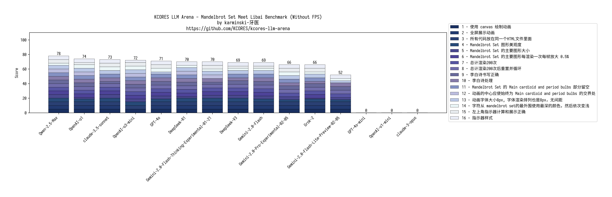

Mandelbrot Set Meet LiBai 测试
------------------------------

## Desc

本测试使用800字+的prompt, 设置需求点16个, 并且包含了性能优化. 需求有针对领域编程(canvas动画), 有针字符串对排序, 去重, 过滤, 有针对数学(Mandelbrot Set 的计算), 有针对文本(李白的诗)的综合要求.

较好的体现了现实世界中复杂需求的场景.

## 测试 Prompt


```markdown

请完成编程比赛，比赛内容如下：

请使用html, css, javascript, 创建一个动画，要求如下：

- 使用 canvas 绘制动画
- 请使用全屏展示动画
- 所有代码需要放在同一个HTML文件里面
- 动画内容是 ASCII 风格的 Mandelbrot Set, Mandelbrot Set 的主要图形初始大小为屏幕的50%，每渲染一次每帧放大 0.5%，总计渲染200次，200次后重置动画循环渲染
- Mandelbrot set 的候选字符使用李白的诗《静夜思》
- 需要对诗词进行去重并保留原有的字符顺序，并且不包含标点符号，可以循环使用
- Mandelbrot Set 的 Main cardioid and period bulbs 部分留空
- 动画的中心应使始终为 Main cardioid and period bulbs 的交界处
- 动画字体大小8px, 字体渲染排列也是8px，无间距
- Mandelbrot Set 字符颜色候选集为（由浅到深色）：#eaf4fc，#eaedf7，#e8ecef，#ebf6f7， #bbc8e6， #bbbcde， #8491c3， #867ba9， #68699b， #706caa， #5654a2， #4d4398， #4a488e， #274a78 ， #2a4073， #223a70， #192f60， #1c305c， #17184b， #0f2350
- 字符从 mandelbrot set的最外围使用最深的颜色，然后依次变浅
- 左上角有一个显示当前FPS的指示器（FPS），以及一个统计平均FPS的指示器（AVG FPS）, 以及一个当前渲染帧序号指示器（CURRENT FRAME: n/200），平均帧率在200帧渲染完毕后计算和更新，黑色字体，背景使用半透明白色圆角

请仔细还原上面每一个要求，每个要求的还原程度均作为采分点  
同时，尽量优化渲染性能，提高FPS。以平均30FPS为满分
运行环境使用Chrome浏览器。CPU为8核心CPU，因此最大可用线程数为8
```


## 评分规则

测试 Prompt 每个 LLM 运行 3 次，取质量最好的一次。如果 3 次均运行失败则直接得 0 分。总计110分满分。
评分时使用 2K 分辨率全屏展示并人工目视评分。


| 序号 | 采分点 | 得分规则 | 
| ---- | ---- | ---- |
| 1 | 使用 canvas 绘制动画 | 使用canvas绘制动画得5分, 否则得0分 |
| 2 | 全屏展示动画 | 全屏展示动画得5分, 否则得0分 |
| 3 | 所有代码放在同一个HTML文件里面 | 所有代码放在同一个HTML文件里面得5分, 否则得0分 |
| 4 | Mandelbrot Set 图形美观度(不涉及大小问题) | 满分5分，长宽比例相等得1分,  Main cardioid 展示清晰得 1分,  能看到 period-2 bulb 得1分，能看到 period-3 bulb 得1分，能看到 period-4 bulb 得1分 |
| 5 | Mandelbrot Set 的主要图形大小 | Mandelbrot Set 的主要图形初始大小约为屏幕的50%得5分, 过大但能看到 period-3 bulb得4分，过大但只能看完整到 Main cardioid 和 period-2 bulb得3分，过大但只能看不完整的 Main cardioid 和 period-2 bulb得2分，只能看到部分 Main cardioid 得1分，其它不得分，过小同理 |
| 6 | Mandelbrot Set 的主要图形每渲染一次每帧放大 0.5% | Mandelbrot Set 的主要图形每渲染一次每帧放大 0.5%得5分, 不满足0.5%但是是放大得3分， 否则得0分 |
| 7 | 总计渲染200次 | 总计渲染200次得5分, 否则得0分 |
| 8 | 总计渲染200次后重置并循环 | 总计渲染200次后重置并循环得5分, 只重置或只循环得3分, 都不满足得0分 |
| 9 | 李白诗书写正确 | 李白诗书写正确得5分, 书写不完全得3分, 只写标题得1分，不书写得0分 |
| 10 | 李白诗处理 | 李白诗去重，保持字符顺序，不包含标点符号，循环使用均满足得5分, 少一项扣一分，均不满足得0分 |
| 11 | Mandelbrot Set 的 Main cardioid and period bulbs 部分留空 | Mandelbrot Set 的 Main cardioid and period bulbs 部分留空得5分, 否则得0分 |
| 12 | 动画的中心应使始终为 Main cardioid and period bulbs 的交界处 | 动画的中心应使始终为 Main cardioid and period bulbs 的交界处得5分, 否则得0分 |
| 13 | 动画字体大小8px, 字体渲染排列也是8px，无间距 | 动画字体大小8px, 字体渲染排列也是8px，无间距得5分, 完成2项得3分，完成一项得2分，都不完成得0分 |
| 14 | 字符从 mandelbrot set的最外围使用最深的颜色，然后依次变浅 | 字符从 mandelbrot set的最外围使用最深的颜色，然后依次变浅得5分, 颜色顺序搞错或不使用全部颜色得3分，均不满足得0分 |
| 15 | 左上角指示器计算和展示正确 | 计算和文本展示正确得5分，计算正确但文本展示有问题得3分，计算不正确得0分 |
| 16 | 指示器样式 | 指示器样式全部满足得5分，样式不正确得3分，全不符合得0分 |
| 17 | 平均FPS水平 | 总分30分，平均FPS大于等于30FPS得满分，否则分数为平均FPS的数值，四舍五入, 注意, 如果最外围不使用文字渲染, 会极大提升帧率, 因此最外围不使用文字渲染扣掉25分. 如果图形过大(只能看到部分Main cardioid, 但仍然可以看到完整的 period-2 bulb), 则扣掉10分, 如果图形过大(且看不到完整的 period-2 bulb), 则扣掉15分 |

* 注意, 如果不是 ASCII 风格的 Mandelbrot Set, 或无任何图像, 则被判为无法完成测试, 直接得 0 分


## 测试结果

| LLM  | 评分项-1 | 评分项-2 | 评分项-3 | 评分项-4 | 评分项-5 | 评分项-6 | 评分项-7 | 评分项-8 | 评分项-9 | 评分项-10 | 评分项-11 | 评分项-12 | 评分项-13 | 评分项-14 | 评分项-15 | 评分项-16 | 评分项-17 | 最终得分 | 
| ---- | ---- | ---- | ---- | ---- | ---- | ---- | ---- | ---- | ---- | ---- | ---- | ---- | ---- | ---- | ---- | ---- | ---- | ---- | 
| DeepSeek-R1 | 5 | 5 | 5  |  5 | 2 (过大, 只能看不完整的 Main cardioid 和 period-2 bulb)  | 5  | 5  | 5  | 5  | 5  |5  | 5 | 5 |  3 (颜色不正确) |  0  (计算不正确) | 5 |  20 (-10, 过大, 但能看到完整的 period-2 bulb) | 90 |
| DeepSeek-V3 | 5 | 5  | 5  | 5  | 4 (过大但能看到 period-3 bulb)  | 5  | 5 | 5 | 5 | 4 (没有去重) | 5  | 0 (画面中心不在交界处) | 5  | 3 (颜色不正确) | 3 (CURRENT FRAME 数值展示多了个/200)  | 5 | 13 | 82  | 
| GPT-4o-mini |  | | | | | | | | | | | | | | | | | 0 (不是ASCII风格的Mandelbrot Set) | 
| GPT-4o |   5 | 5 | 5 | 4 (长宽比例不等) | 4 (没有达到正好50%) | 5 | 5 | 5 | 5 | 5 | 5 | 0 (画面中心不在交界处) | 3 (排列尺寸不正确) | 5 | 5 | 5 | 12 | 83  | 
| Gemini-2.0-Flash-Lite-Preview-02-05 |  5 | 5 | 5 | 3 (比例虽然相等, 但是只能识别出Main cardioid 和 period-2 bulb) | 3 (只能看到Main cardioid 和 period-2 bulb) | 0 (实际图形并没有放大) | 5 | 5 | 5 | 5 | 0 (并未留空) | 0 (画面中心不在交界处) | 3 (排列尺寸不正确) | 3 (颜色不正确) | 0  (计算不正确) | 5 | 9 | 61 | 
| Gemini-2.0-Flash-Thinking-Experimental-01-21 |5  | 5 | 5 | 5 | 4 (过小, 但能看到period-3 bulb) | 5 | 5 | 5 | 3 (把标题写进去了) | 5 | 0 (并未留空) | 5 | 5 | 3 (没有使用全部颜色) | 5 | 5 | 5 (-25, 最外部没有使用文本渲染) | 75 | 
| Gemini-2.0-Flash |  5  | 5 | 5 | 4 (长宽比例不等)  | 4 (过小, 但能看到period-3 bulb) | 5 | 5 | 5 | 5 | 5 | 5 | 0 (画面中心不在交界处) | 5| 3 (颜色弄反了) | 3 (展示有问题) | 5 | 7 | 76 | 
| Gemini-2.0-Pro-Experimental-02-05 | 5 | 5 | 5 | 3 (过小, 且比例不等, 但能看到 period-3 bulb) | 4 (过小, 但能看到period-3 bulb) | 0 (应该放大, 但是动画是缩小) | 5 | 5 | 5 | 4 (并未保留顺序) | 5 | 0 (画面中心不在交界处) | 5  | 5 | 5| 5 | 5 | 71 | 
| OpenAI-o1-mini | | | | | | | | | | | | | | | | | | 0 (虽然也展示了文字, 但文字叠在了Mandelbrot Set上方, 并不符合需求, 但这个demo挺好看的) | 
| OpenAI-o1 | 5 | 5 | 5 | 4 (长宽比例不等)   | 2 (过大, 只能看不完整的 Main cardioid 和 period-2 bulb) | 5 | 5 | 5 |5  | 5 | 5| 5| 5 | 5 | 3 (CURRENT FRAME 数值展示多了个/200) | 5 | 8 (-10, 过大, 但能看到完整的 period-2 bulb) | 82 | 
| OpenAI-o3-mini | 5 | 0 (没有全屏展示动画) | 5 | 5 | 4 (过小, 但能看到period-3 bulb)  | 5 | 5 | 5 | 5 | 5 | 5 | 5 | 5 | 5 | 5 |  3 (宽度不够) | 5 (-25, 最外部没有使用文本渲染) | 77 | 
| claude-3-opus |  | | | | | | | | | | | | | | | | | 0 (不是ASCII风格的Mandelbrot Set) | 
| claude-3.5-sonnet | 5 | 5 | 5 | 5 | 5 | 5 | 5 | 5 | 3 (书写不正确) | 5 (Set 在浏览器实际实践中保证了顺序) | 5 | 0 (画面中心不在交界处) | 5 | 5 | 5 | 5 | 13 | 86 | 
| Qwen-2.5-Max | 5 | 5 | 5 | 5 | 5 | 5 | 5 | 5 | 5| 5 | 5 | 5 | 5 | 3 (颜色顺序搞错了) |  5 | 5 | 12 | 90 |
| Grok-2 | 5 | 5 | 5 | 4 (长宽比例不等) | 1 (只能看到 Main cardioid) | 5 | 5 | 5 | 5 | 3 (未去重, 未保留顺序) | 5 | 0 (画面中心不在交界处) | 5 | 3 (颜色不正确) | 5 | 5 | 1 (-15, 看不到完整的 period-2 bulb) | 67 | 


## 可视化结果

- 整体结果, FPS 数据占比较大, 体现了模型的代码优化水平


- 不包含 FPS 数据结果, 体现了 LLM 在需求还原上的表现




## 结论

- 从目视来讲, 效果最好的是 DeepSeek-R1 和 Qwen-2.5-Max. 其中 DeepSeek-R1 的代码性能最高, 而 Qwen-2.5-Max 的需求还原能力最高, 并且在全部测试项中与 DeepSeek-R1分数一致, 仅有颜色顺序搞错了这一项扣分点. 
- 两种统计方式中, claude-3.5-sonnet 稳坐第三名, 从实际目视来讲, claude-3.5-sonnet 也的确给出了很不错的效果 (除了没有按要求居中动画和唐诗能力不太行以外, 其他表现均不错). 
- 代码质量上 (注意不是代码水平而是代码质量), OpenAI-o1 当之无愧是第一名, 达到了一流开源软件的代码质量.
- Gemini 综合质量垫底, 新出的 02-05 版本甚至没有 Gemini-2.0-Flash 和 Gemini-2.0-Flash-Thinking-Experimental-01-21 表现好. 
- 综合来讲本测试项目中最优秀的模型是 Qwen-2.5-Max.


## Winner


Qwen-2.5-Max


