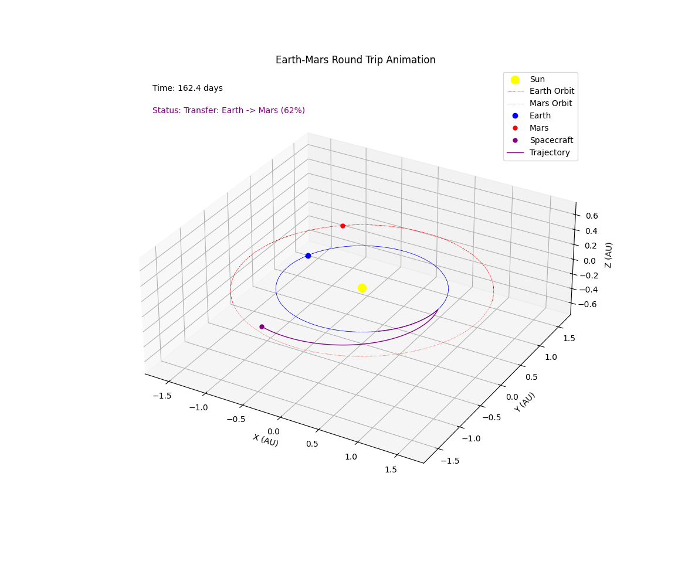
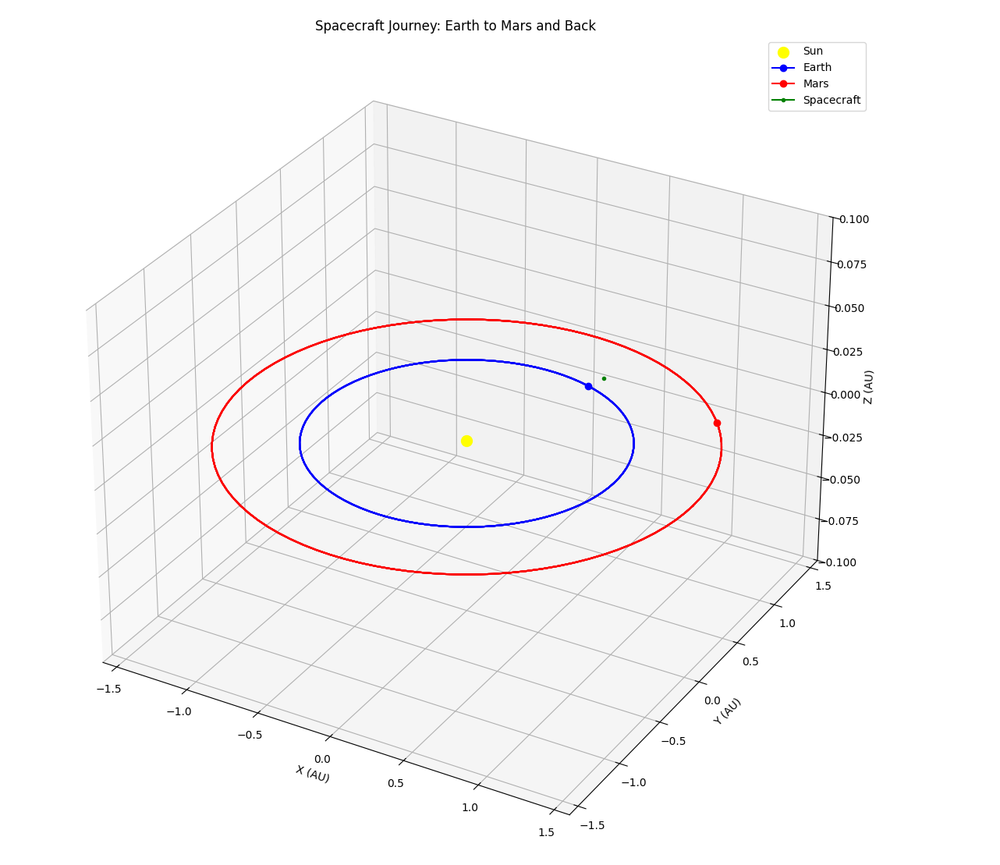

Mars Mission Animation 测试
---------------------------

## Desc

使用 Grok-3 发布时的 demo Prompt 对流行的前沿大模型进行测试.

### 该项目主要测试

- 需求还原
  - 展示各个行星
  - 动画效果展示公转
  - 展示轨迹
- 需求补全
  - 补全演示中缺失的坐标系与图例
  - 渲染太阳
- 计算
  - 圆周轨道与运行周期
  - 飞船的飞行轨迹
  - 飞船准确降落行星
- 物理
  - 天体运行轨道半径
  - 天体运行周期
  - 飞行器发射窗口与返回窗口
- 编程语言
  -Python
- Prompt 语言
  - 英文

## 测试 Prompt


```markdown
Generate code for an animated 3d plot of a launch from earth landing on mars and then back to earth at the next launch window

```


## 评分规则

测试 Prompt 每个 LLM 运行 3 次，取质量最好的一次。如果 3 次均运行失败则直接得 0 分。总计 65 分满分。
评分时使用 2K 分辨率全屏展示并人工目视评分。


| 序号 | 采分点                                                         | 得分规则                           |
| ---- | ------------------------------------------------------------ | -------------------------------- |
| 1    | 展示太阳                                                      | 展示得5分, 否则得0分      |
| 2    | 展示地球, 火星, 以及宇宙飞船                                   | 均展示得5分, 否则得0分     |
| 3    | 展示地球, 火星绕太阳公转                                       | 均展示得5分, 展示不完全得3分, 否则得0分    |
| 4    | 展示地球, 火星, 以及宇宙飞船的运动轨迹                           | 均展示得5分, 展示不完全得3分, 否则得0分     |
| 5    | 宇宙飞船从地球发射, 并沿椭圆轨道成功着陆火星                     | 均展示得5分, 展示不完全得3分, 轨道错误得0分       |
| 6    | 宇宙飞船从火星返回, 并沿椭圆轨道成功着陆地球                    | 均展示得5分, 展示不完全得3分, 轨道错误得0分      |
| 7    | 轨道比例                                                      | 地球为1AU, 火星大约1.5AU, 轨道位置精确符合坐标轴得5分, 相对大小复合比例得3分, 否则得0分     |
| 8    | 发射周期                                                      | 发射后大约耗时259天, 偏差小于10%得5分, 偏差小于50%得3分, 偏差大于50%得0分      |
| 9    | 返回窗口                                                      | 火星返回窗口须在发射后等待约450天, 偏差小于10%得5分, 偏差小于50%得3分, 偏差大于50%得0分     |
| 10   | 三维空间表现                                                   | Z轴方向有轨道倾角变化得5分, 否则得0分       |
| 11   | 比例尺                                                        | 显示天文单位标尺得5分, 仅有比例尺得3分,  否则得0分      |
| 12   | 图例标注                                                      | 显示图例包含 地球, 火星, 宇宙飞船, 太阳 得5分, 不完全得3分 否则得0分       |
| 13   | 动画流畅性                                                    | 动画流畅得5分, 过快或过慢得3分, 无法完成演示得0分       |

* 注意, 无法运行, 运行错误退出, 运行无画面, 运行不是动画则判定为未完成 prompt, 直接得 0 分

## 测试结果


| LLM  | 评分项-1 | 评分项-2 | 评分项-3 | 评分项-4 | 评分项-5 | 评分项-6 | 评分项-7 | 评分项-8 | 评分项-9 | 评分项-10 | 评分项-11 | 评分项-12 | 评分项-13 | 最终得分 |
| ---- | ---- | ---- | ---- | ---- | ---- | ---- | ---- | ---- | ---- | ---- | ---- | ---- | ---- | ---- |
| Claude-3.5-sonnet | 0 | 5 | 5 | 3 (无飞船轨迹) | 5 | 5 | 3 (比例正确) | 3 (偏差小于50%) | 0 (立刻返回了) | 5  | 3 (有比例尺) | 3 (无太阳) | 5  | 45 |
| DeepSeek-R1 | 0 | 5 | 5  |  3 (无行星轨迹) | 0 (轨道错误)  | 0 (轨道错误)  | 5  | 0 (偏差大于50%)  | 0 (偏差大于50%)  | 0 (无倾角)  | 5  | 0 (无图例) | 5  | 28 |
| DeepSeek-V3 | 0 | 0 (没展示)  | 0 (没展示)  | 5  | 0 (轨道错误)  | 0 (轨道错误)  | 3 (比例正确) | 0 (偏差大于50%)  | 0 (偏差大于50%)  | 0 (无倾角) | 3 (有比例尺)  | 3 (无太阳) | 5  | 19  |
| Gemini-2.0-Flash-Lite-Preview-02-05 |  5 | 5 | 5 | 3 (宇宙飞船卡在原地) | 0 (轨道错误)| 0 (轨道错误) | 3 (比例正确) | 0 (飞船抛锚了) | 0 (飞船抛锚了) | 0 (无倾角) | 3 (有比例尺) | 5 |  0 (无法完成演示) | 29 |
| Gemini-2.0-Flash-Thinking-Experimental-01-21 | 0 | 5 | 5 | 3 (只有飞船轨迹) | 0 (轨道错误) | 0 (轨道错误) | 3 (比例正确) | 0 (飞船轨迹错误) | 0 (飞船轨迹错误) | 0 (无倾角) | 3 (有比例尺) | 3 (无太阳) | 5 | 27 |
| Gemini-2.0-Flash |  5  | 5 | 5 | 5  | 0 (轨道错误)  | 0 (轨道错误)  | 3 (比例正确) | 3 (偏差小于50%) | 0 (偏差大于50%) | 0 (无倾角) | 3 (有比例尺) | 5 | 5| 39 |
| Gemini-2.0-Pro-Experimental-02-05 | 5 | 5 | 5 | 3 (无行星轨迹) | 0 (轨道错误) | 0 (轨道错误) | 5 | 3 (偏差小于50%) | 0 (偏差大于50%) | 0 (无倾角) | 5 | 5 | 5  | 41 |
| GPT-4o |   0 | 0 (无法辨别) | 0 (无法辨别) | 0 (无法辨别) | 0 (无法辨别) | 0 (无法辨别) | 0 (无法辨别) | 0 (无法辨别) | 0 (无法辨别) | 0 (无倾角) | 3 (有比例尺)  | 0 (无图例) | 0 (无法完成演示)  | 3 |
| Grok-2 |   0 | 3 (只能看到飞船) | 0 (无法辨别) | 5 | 0 (无法辨别) | 0 (无法辨别) | 3 (比例正确) | 0 (无法辨别) | 0 (无法辨别) | 0 (无倾角) | 3 (有比例尺)  | 3 (只有飞船) | 0 (无法完成演示)  | 17 |
| Grok-3 |   0 | 5 | 5 | 5 | 0 (轨道错误) | 0 (轨道错误) | 5 | 3 (偏差小于50%)  | 0 (偏差大于50%)  | 0 (无倾角) | 5  | 3 (无太阳) |5  | 36 |
| Grok-3-Reasoning |   5 | 5 | 5 | 3 (无飞船轨迹) | 0 (轨道错误) | 0 (轨道错误) | 5 | 5  | 5  | 0 (无倾角) | 5  | 5 |5  | 48 |
| OpenAI-o1-mini |   0 | 0 (无法辨别) | 0 (无法辨别) | 0 (无法辨别) | 0 (无法辨别) | 0 (无法辨别) | 0 (无法辨别) | 0 (无法辨别) | 0 (无法辨别) | 0 (无倾角) | 3 (有比例尺)  | 0 (无图例) | 0 (无法完成演示)  | 3  |
| OpenAI-o1 |  0 | 5 | 5 | 3 (无飞船轨迹) | 5| 5 | 5 | 3 (偏差小于50%) | 3 (偏差小于50%)| 0 (无倾角) | 5 | 3 (无太阳) |  5 | 48 |
| OpenAI-o3-mini |  5 | 5 | 0 (不公转) | 5 |  0 (轨道错误) | 0 (轨道错误) | 5 | 3 (偏差小于50%) | 0 (偏差大于50%)| 0 (无倾角) | 5 | 5 |  0 (无法完成演示) | 33 |
| Qwen-2.5-Max |  0 | 5 | 5 | 3 (展示不完全) |  5 | 0 (轨道错误) | 5 | 3 (偏差小于50%) | 0 (偏差大于50%)| 0 (无倾角) | 5 | 3 (无太阳) |  5 | 39 |
| Claude-3.7-Sonnet |  0 | 5 | 5 | 5 | 0 (轨道错误) | 0 (轨道错误) | 5  | 5 | 5 | 0 (无倾角) | 3 (有比例尺) | 3 (无太阳) |  3 （动画过慢） | 39 |
| Claude-3.7-Sonnet-Thinking |  5 | 5 | 5 | 5 |  0 (轨道错误)  | 0 (轨道错误) | 5 | 3 (偏差小于50%) | 0 (偏差大于50%)| 0 (无倾角) | 5 | 5 |  5 | 43 |
| Qwen-2.5-Max-Thinking (QwQ-Preview) |  5 | 5 | 5 | 5 |  0 (轨道错误) | 0 (轨道错误) | 5 | 5 | 0 (偏差大于50%)| 0 (无倾角) | 5 | 3 (无太阳) |  5 | 43 |
| GPT-4.5-Preview |  0 | 0 | 0  | 0|  0  | 0 | 0 | 0 | 0 | 0  | 0 | 0 |  0 | 0 |
| GPT-4o-mini |  0 | 0 | 0  | 0|  0  | 0 | 0 | 0 | 0 | 0  | 0 | 0 |  0 | 0 |
| Qwen-QwQ-32B-BF16 |  5  | 5 | 5 | 5  | 0 (轨道错误)  | 0 (轨道错误)  | 5 | 3 (偏差小于50%) | 0 (偏差大于50%) | 0 (无倾角) | 5 | 5 | 5| 43 |
| Gemma-3-27B-it-BF16 |  0 | 0 | 0  | 0|  0  | 0 | 0 | 0 | 0 | 0  | 0 | 0 |  0 | 0 |
| ERNIE-4.5 | 0 | 5 | 5 | 5 | 0 (轨道错误) | 0 (轨道错误) | 5 | 0 (偏差大于50%) | 0 (偏差大于50%) | 0 (无倾角) | 3 (有比例尺) | 3 (无太阳) | 0 (无法完成演示) | 26 |
| ERNIE-X1 | 5 | 5 | 5 | 3 (仅展示宇宙飞船轨迹) | 0 (轨道错误) | 0 (轨道错误) | 5 | 5 | 3 (偏差小于50%) | 0 (无倾角) | 5 | 0 (无图例) | 5 | 41 |
| Doubao-1.5-pro-32k | 5 | 5 | 5 | 5 | 0 (飞船轨道错误) | 0 | 3 (轨道比例错误) | 0 | 0 | 0 (无倾角) | 5 | 5 | 5 | 38 |
| kimi-k1.5-long-thinking | 0 (没有太阳) | 5 | 5 | 3 (飞船没有展示轨道) | 0 (轨道错误) | 0 | 5 | 5 | 0 (返回窗口错误) | 0 (无倾角) | 5 | 3 (图例不全) | 3 (动画过快) | 34 |
| DeepSeek-V3-0324 | 5 | 5 | 5 | 5 | 0 (轨道错误) | 0 (轨道错误) | 3 (比例正确) | 3 (偏差小于50%) | 3 (偏差小于50%) | 5  | 3 (有比例尺) | 5 | 5  | 47 |
| Gemini-2.5-Pro-Experimental-03-25 |   5 | 5 | 5 | 5 | 5| 5 | 5 | 5  | 5  | 0 (无倾角) | 5  | 5 | 5  | 60 |
| hunyuan-turbos-20250313 | 0 | 0 | 0 | 0| 0 | 0 | 0 | 0 | 0 | 0 | 0 | 0 | 0 | 0 |
| Llama-4-Scout-17B-16E(109B)                  | 0 | 3 (展示不完全) | 0 (无公转) | 3 (无星球轨迹) | 0 (轨道错误)  | 0 (轨道错误) | 0 (看不出比例) | 0 (错误) | 0 (错误) | 0 (无空概念表现)  | 3 (有比例尺) | 0 (无图例) | 5  | 14 |
| Llama-4-Maverick-17B-128E(402B)              | 5 | 5 | 5 | 5 |  0 (轨道错误)  | 0 (轨道错误) | 5 | 0 (偏差大于50%)  | 0 (偏差大于50%) | 0  | 5 | 0 (无图例) | 5  | 35 |


## 可视化结果


## Winner

**👑Gemini-2.5-Pro-Experimental-03-25**

## 结论

本测试难度还是非常大的, 其中 Grok-3 发布会上的 demo 视频看上去很唬人, 但实际使用相同的 prompt 测试, 很难复现一致的效果.

而 **Gemini-2.5-Pro-Experimental-03-25** 则惊人的完成了这一项目, 连最难的发射周期和返回窗口都计算正确.

目前第一名是 **Gemini-2.5-Pro-Experimental-03-25**




Grok-3-Reasoning 为第二名, 在搜索的加持下, 表现非常亮眼, 得分很高, 需求完成很好, 轨道周期计算很准确, 但动画计算还是出现了问题, 有抖动, 并不能完整表现飞船的着陆. 




OpenAI-o1, 为第三名, 飞船轨道计算得很好所以得分很高.


Claude-3.5-sonnet 表现始终稳定, 处于并列第三名, 比较亮眼的是火星运行轨道表现得很不错, 但是卫星发射窗口没有计算在内.


