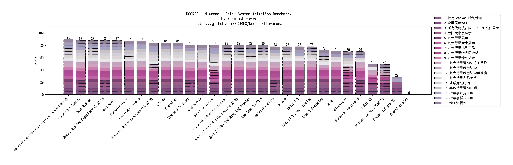
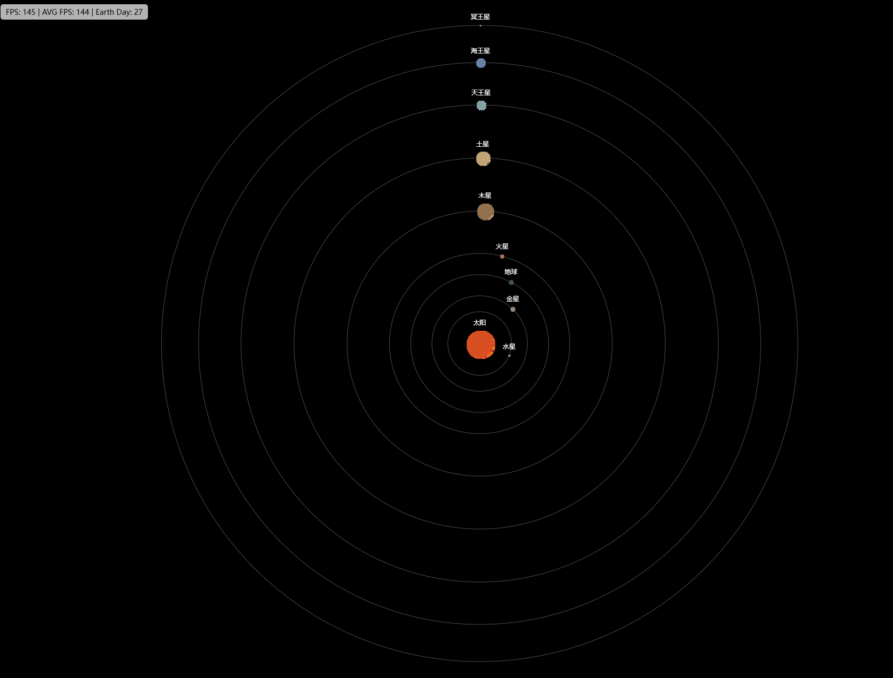
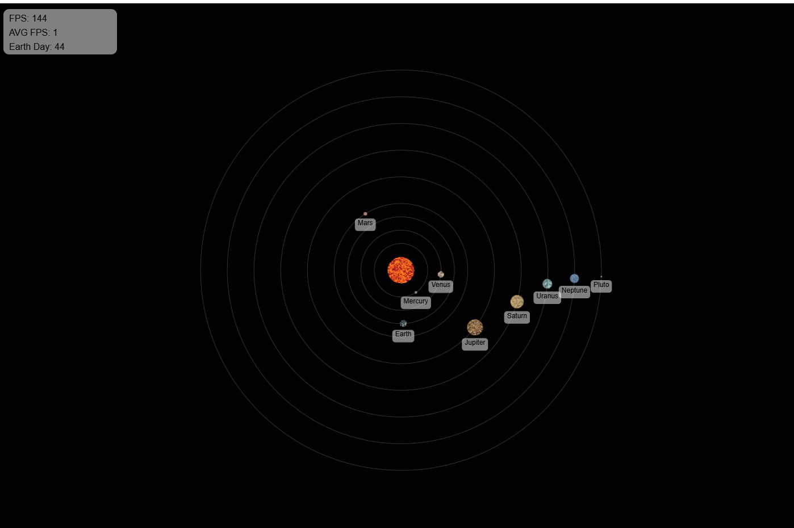

Solar System Animation 测试
---------------------------

## Desc


## 测试 Prompt


```markdown

创建一个符合以下规格的HTML5 Canvas太阳系动画：

0. **要求**
- 所有代码应在一个HTML文件中
- 使用canvas绘制动画
- 全屏显示动画

1. **天体要求**
- 包括：太阳，9颗行星
- 由于太阳过大, 因此所有星球只要展示相对大小即可, 比如太阳最大, 木星次之
- 行星按照距离太阳的远近排列, 从内到外依次是水星, 金星, 地球, 火星, 木星, 土星, 天王星, 海王星, 冥王星
- 注意各个星球的轨道间距要大于星球本身的直径，以免造成视觉上的重叠

2. **视觉设计**
- 每个星球使用4种颜色做像素填充，仅填充一次
  • 太阳：#f2831f, #f15d22, #d94125, #a41d22
  • 水星：#5a5856, #bfbdbc, #8c8a89, #f4f6f8
  • 金星：#868a8d, #d9b392, #f3dbc3, #414141
  • 地球：#1f386f, #0b1725, #386f61, #dac0a5
  • 火星：#dabd9e, #8c5d4b, #f27c5f, #c36d5c
  • 木星：#282411, #c08137, #bfb09c, #a6705b
  • 土星：#f3cf89, #dab778, #736b59, #c1a480
  • 天王星：#3f575a, #688a8c, #95bbbe, #cfecf0
  • 海王星：#647ba5, #7595bf, #4e5d73, #789ebf
  • 冥王星：#d8cbbb, #f4ebdc, #402a16, #a79f97
- 轨道线：半透明白色圆圈
- 标签：
  • 始终面向摄像机的星球文字标签
  • 格式：[星球名称]

3. **运动模拟**
- 时间压缩：1秒真实时间=10个地球日, 地球绕太阳一周为365个地球日
- 行星公转轨道使用圆形轨道即可
- 层次结构：
  • 所有行星围绕太阳运行

4. **技术实现**
- 使用requestAnimationFrame实现平滑动画

5. **性能优化**
- 离屏canvas用于静态元素（轨道线）
- 使用Web Workers进行位置计算

6. **计数器**
- 在左上角显示当前FPS指示器（FPS）和平均FPS指示器（AVG FPS），以及当前地球日计数 (Earth Day)
- 使用黑色文字和半透明白色圆角背景


注意，不要省略星球视觉设计的代码，我需要你实现全部的代码。
```


## 评分规则

测试 Prompt 每个 LLM 运行 3 次，取质量最好的一次。如果 3 次均运行失败则直接得 0 分。总计 90 分满分。
评分时使用 2K 分辨率全屏展示并人工目视评分。


| 序号 | 采分点                                                         | 得分规则                           |
| ---- | ------------------------------------------------------------ | -------------------------------- |
| 1 | 使用 canvas 绘制动画                                             | 使用canvas绘制动画得5分, 否则得0分 |
| 2 | 全屏展示动画                                                      | 全屏展示动画得5分, 全屏但是动画超过了部分屏幕得3分, 否则得0分 |
| 3 | 所有代码放在同一个HTML文件里面                                    | 所有代码放在同一个HTML文件里面得5分, 否则得0分 |
| 4 | 太阳大小及展示                                                        | 展示太阳且是最大的且位置正确得5分, 展示太阳但尺寸不对或位置有问题得3分, 不展示太阳得0分 |
| 5 | 九大行星展示                                                       | 均展示得5分, 展示不完全得3分, 不展示得0分 |
| 6 | 九大行星大小展示                                                    | 大小比例符合事实得5分, 部分比例错误得3分, 比例完全错误得0分 |
| 7 | 九大行星排列正确                                                   | 排列正确得5分, 错误得0分 |
| 8 | 九大行星绕太阳公转                                                | 均展示得5分, 展示不完全得3分, 不展示得0分   |
| 9 | 九大行星运动轨迹                                                    | 均展示且按照轨迹运行得5分, 展示不完全(包括背景色的原因不可见)或部分不按照轨迹运行得3分, 否则得0分 |
| 10 | 九大行星运动轨迹不重叠                                            | 完全不重叠得5分, 部分重叠得3分, 乱作一团得0分 |
| 11 | 九大行星颜色渲染                                                 | 使用全部给定颜色得5分, 使用部分颜色得3分, 否则得0分 |
| 12 | 九大行星颜色渲染美观度                                            | 颜色同心渲染或随机渲染得5分, 简单排列得3分, 颜色不正确得0分 |
| 13 | 九大行星名称标签                                                 | 全部展示且正确5分, 部分被遮挡或颜色导致部分看不清得4分, 部分展示或部分错误得3分, 不展示或全部错误得0分 |
| 14 | 地球运动时间                                                 | 一周正好36.5s或偏差小于10%得5分, 偏差小于50%得3分, 偏差大于50%得0分 |
| 15 | 其他行星运动时间                                                 | 相对于地球计算, 均差小于10%得5分, 均偏差小于50%得3分, 部分偏差小于50%得2分,  整体偏差大于50%得0分 |
| 16 | 指示器计算正确                                                 | 均计算正确得5分, 计算错误得0分 |
| 17 | 指示器样式正确                                                 | 样式正确得5分, 部分样式正确得3分, 样式全部错误得0分 |
| 18 | 动画流畅性                                                  | 动画流畅得5分, 过快或过慢得3分, 无法完成演示得0分 |


* 注意, 无法运行, 运行错误退出, 运行无画面, 运行不是动画则判定为未完成 prompt, 直接得 0 分


## 测试结果


| LLM  | 评分项-1 | 评分项-2 | 评分项-3 | 评分项-4 | 评分项-5 | 评分项-6 | 评分项-7 | 评分项-8 | 评分项-9 | 评分项-10 | 评分项-11 | 评分项-12 | 评分项-13 | 评分项-14 | 评分项-15 | 评分项-16 | 评分项-17 | 评分项-18 |最终得分 |
| ---- | ---- | ---- | ---- | ---- | ---- | ---- | ---- | ---- | ---- | ---- | ---- | ---- | ---- | ---- | ---- | ---- | ---- | ---- | ---- |
| Claude-3.5-Sonnet | 5 | 3 (全屏但是动画超过了屏幕) | 5 | 5 | 5 | 5 | 5 | 5 | 5 | 5 | 5 | 5 | 5 | 5 | 5 | 5 | 5 | 5 | 88 |
| Claude-3.7-Sonnet-Thinking | 5 | 5 | 5 | 5 | 5 | 5 | 5 | 5 | 5 | 5 | 5 | 5 | 5 | 0 (地球速度过快了) | 5 | 0  (AVE FPS 计算错误)| 5 | 5 | 80 |
| Claude-3.7-Sonnet | 5 | 3 (全屏但是动画超过了屏幕) | 5 | 5 | 5 | 5 | 5 | 5 | 5 | 5 | 5 | 3 (颜色简单排列) | 5 | 5 | 5 | 0 (AVE FPS 计算错误) | 5 |5 | 81 |
| DeepSeek-R1 | 5 | 5 | 5 | 5 | 5 | 5 | 5 | 5 | 5 | 3 (部分轨道重叠) | 5 | 5 | 5 | 5 | 5 | 5 | 5 |5 | 87 |
| DeepSeek-V3 | 5 | 5 | 5 | 5 | 5 | 5 | 5 | 5 | 3 (背景色是白色造成轨迹不可见) | 5 | 5 | 5 | 5 | 5 | 5 | 0 (AVE FPS 计算错误) | 3 (指示器背景无圆角) |5 | 81 |
| Gemini-2.0-Flash-Lite-Preview-02-05 |  5 | 5 | 5 | 5 | 5 | 5 | 5 | 5 | 5 | 5 | 5 | 5 | 5 | 0 (偏差大于50%) | 5 | 5 | 0 (无样式) |5 | 80 |
| Gemini-2.0-Flash-Thinking-Experimental-01-21 |  5 | 5 | 5 | 5 | 5 | 5 | 5 | 5 | 5 | 5 | 5 | 5 | 5 | 5 | 5 | 5 | 5 |5 | 90 |
| Gemini-2.0-Flash |  5 | 3 (全屏但是动画超过了屏幕) | 5 | 5 | 5 | 5 | 5 | 5 | 5 | 5 | 5 | 5 | 5 | 0 (太慢了,偏差大于50%) | 5 | 5 | 0 (Earth Day 计算错误) |5 | 78 |
| Gemini-2.0-Pro-Experimental-02-05 |  5 | 5 | 5 | 3 (太阳位置有问题) | 5 | 5 | 5 | 5 | 3 (未按照轨迹运行) | 3 (轨迹重叠) | 5 | 5 | 5 | 5 | 5 | 5 | 5 |5 | 84 |
| GPT-4o-mini | 5 | 3 (全屏但是动画超过了屏幕) | 5 | 5 | 3 (展示不完全) | 5 | 5 | 5 | 3 (背景色是白色造成轨迹不可见) | 5 | 3 (仅使用部分颜色) | 3 (颜色简单排列) | 5 | 0 (地球速度过快) | 5 | 5 | 0 (Earth Day 计算错误) | 5 | 70 |
| GPT-4o | 5 | 5 | 5 | 5 | 5 | 5 | 5 | 5 | 5 | 5 | 5 | 5 | 4 (标签被遮挡) | 5 | 5 | 0 (AVE FPS 计算错误) | 5 | 5 | 84 |
| Grok-2 | 5 | 5 | 5 | 5 | 5 | 5 | 5 | 5 | 5 | 5 | 3 (仅使用部分颜色) | 3 (颜色简单排列) | 5 | 0 (速度过快) | 0 (速度过快) | 0 (Earth Day 计算错误) | 5 | 5 | 71 |
| Grok-3-Reasoning | 5 | 5 | 5 | 5 | 5 | 5 | 5 | 5 | 3 (背景色是白色造成轨迹不可见) | 0 (行星乱作一团) | 5 | 5 | 4 (乱作一团导致遮挡) | 0 (速度过慢) | 5 | 0 (Earth Day 计算错误) | 5 | 5 | 72 |
| Grok-3 | 5 | 5 | 5 | 5 | 5 | 5 | 5 | 5 | 5 | 5 | 5 | 5 | 5 | 0 (速度过快) | 5 | 0 (Earth Day 计算错误) | 3 (文本超过了背景) | 5 | 78 |
| OpenAI-o1-mini | 0 | 0 | 0 | 0 | 0 | 0 | 0 | 0 | 0 | 0 | 0 | 0 | 0 | 0 | 0 | 0 | 0 | 0 | 0 (无法展示) |
| OpenAI-o1 | 5 | 5 | 5 | 5 | 5 | 5 | 5 | 5 | 5 | 5 | 5 | 5 | 4 (标签被遮挡) | 5 | 5 | 0 (Earth Day 计算错误) | 5 | 5 | 84 |
| OpenAI-o3-mini | 5 | 5 | 5 | 5 | 5 | 5 | 5 | 5 | 5 | 5 | 5 | 3 (颜色简单排列) | 4 (标签被遮挡) | 5 | 5 | 5 | 5 | 5 | 87 |
| Qwen-2.5-Max-Thinking-QwQ-Preview | 5 | 5 | 5 | 5 | 5 | 5 | 5 | 5 | 3 (背景色是白色造成轨迹不可见) | 5 | 5 | 5 | 4 (标签被遮挡) | 0 (速度过快) | 5 | 5 | 3 (没有圆角) | 5 | 80 |
| Qwen-2.5-Max | 5 | 5 | 5 | 5 | 5 | 5 | 5 | 5 | 5 | 5 | 5 | 5 | 5 | 5 | 5 | 5 | 3 (没有圆角且文本超过了背景) | 5 | 88 |
| GPT-4.5-Preview | 5 | 5 | 5 | 3 (太阳不是圆的) | 3 (行星不是圆的) | 5 | 5 | 5 | 3 (背景色是白色造成轨迹不可见) | 3 (部分轨道重叠) | 5 | 5 | 4 (标签被遮挡) | 5 | 5 | 5 | 5 | 5 | 81 |
| Qwen-QwQ-32B-BF16 | 5 | 5 | 5 | 5 | 5 | 5 | 5 | 5 | 5 | 5 | 5 | 5 | 4 (颜色导致看不清) | 5 | 5 | 5 | 5 | 3 (没有圆角) | 87 |
| Gemma-3-27B-it-BF16 | 5 | 3 (全屏但是动画超过了屏幕) | 5 | 5 | 5 | 5 | 5 | 5 | 5 | 5 | 5 | 3 (简单色块渲染) | 4 (标签被遮挡) |  0 (速度过快) | 0 (速度过快) | 0 (计算错误) | 5 | 5 | 70 |
| ERNIE-4.5 | 5 | 5 | 5 | 5 | 5 | 5 | 5 | 5 | 5 | 5 | 5 | 5 | 3 (标签方向不是始终向下) | 0 (速度过快) | 0 (速度过快) | 5 | 5 | 5 | 78 |
| ERNIE-X1 | 5        | 0 (没有全屏)               | 5        | 5                  | 3 (展示不完全，金星以外的部分超出屏幕范围) | 3 (展示不完全，金星以外的部分超出屏幕范围) | 5        | 3 (展示不完全，金星以外的部分超出屏幕范围) | 3 (展示不完全，金星以外的部分超出屏幕范围) | 5                | 3 (展示不完全，金星以外的部分超出屏幕范围，太阳、水星、金星颜色正确) | 5 (展示不完全，金星以外的部分超出屏幕范围，太阳、水星、金星同心圆渲染) | 0 (标签满屏幕乱飞)       | 0 (屏幕内看不到地球)   | 0 (屏幕内看不到地球) | 0 (计算错误)           | 0 (无样式)                   | 5            | 50           |


## 可视化结果




## 结论

**Gemini-2.0-Flash-Thinking-Experimental-01-21** 表现最佳, 没有犯任何错误



**Claude-3.7-Sonnet-Thinking** 则犯了不少错误, 包括地球公转速度过快, AVE FPS 计算错误



## Winner

**👑Gemini-2.0-Flash-Thinking-Experimental-01-21**
